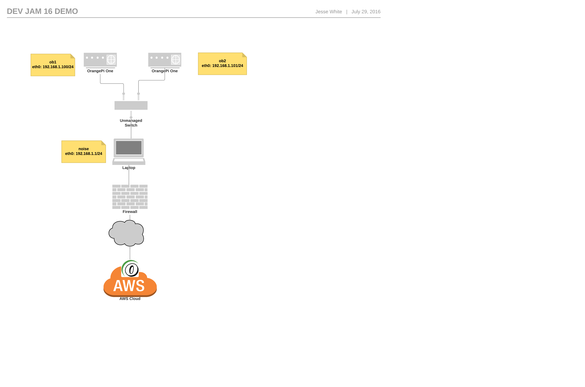

# Underling Provisioning & SNMP Data Collection Demo

## Agenda

1. Solution Overview
1. OpenNMS Setup
1. Minion Setup
1. Karaf Shell Extensions
1. Provisioning

## Solution Overview

### Underling

Minion written in Go, see https://github.com/j-white/underling.

### Diagram



### Hardware

2 x [Orange Pi One](http://www.orangepi.org/orangepione/)

* 1.2 Ghz ARM Cortex
* 512MB DDR
* 10$
* Running ARMBIAN Debian GNU/Linux 8 (jessie) 3.4.112-sun8i

### Network setup

noise is @ 192.168.1.1

ob1 is @ 192.168.1.100 (86:54:e1:31:66:76)

ob2 is @ 192.168.1.101 (9a:0d:90:08:93:90)

    sudo ifconfig enp0s25 192.168.1.1/24
    sudo systemctl restart dhcpd


### OpenNMS Setup

Underling uses the STOMP protocol for communicating with OpenNMS's ActiveMQ service.

To enable STOMP, add the following to `etc/opennms-activemq.xml` in the `<transportConnectors>` section:

```xml
<transportConnector name="stomp" uri="stomp+nio://0.0.0.0:61613"/>
```

### Setting up ob2

Install Go

    sudo apt-get install golang

Setup your GOPATH

    export GOPATH=/home/jesse/go

Setup godep

    go get github.com/tools/godep
    export PATH=$PATH:$GOPATH/bin

Grab the code

    go get github.com/j-white/underling

Build

    cd $GOPATH/src/github.com/j-white/underling
    godep go build

Running

    cp underling.yaml.sample underling.yaml
    vi underling.yaml (update location to DEMO and url to aws-nms-1)
    screen
    ./underling

### Karaf Shell Extensions

    snmp:walk -l DEMO 192.168.1.100 .1.3.6.1.4
    snmp:walk -l DEMO 192.168.1.101 .1.3.6.1.4
    snmp:walk -l DEMO 127.0.0.1 .1.3.6.1.2.1.4.34.1.11.1.4
    provision:detect -l DEMO ICMP 192.168.1.100
    provision:detect -l DEMO WS-Man 192.168.1.100

### Provisioning

    http://aws-nms-1:8980/opennms


### SNMP Proxy

#### Request

```xml
<snmp-request location="DEMO" description="NRTG">
   <agent>
      <authPassPhrase>0p3nNMSv3</authPassPhrase>
      <authProtocol>MD5</authProtocol>
      <maxRepetitions>2</maxRepetitions>
      <maxRequestSize>65535</maxRequestSize>
      <maxVarsPerPdu>10</maxVarsPerPdu>
      <port>161</port>
      <privPassPhrase>0p3nNMSv3</privPassPhrase>
      <privProtocol>DES</privProtocol>
      <readCommunity>public</readCommunity>
      <retries>1</retries>
      <securityLevel>1</securityLevel>
      <securityName>opennmsUser</securityName>
      <timeout>1800</timeout>
      <version>2</version>
      <versionAsString>v2c</versionAsString>
      <writeCommunity>private</writeCommunity>
      <address>192.168.1.100</address>
   </agent>
   <walk correlation-id="0" max-repetitions="1" instance=".0">
      <oid>.1.3.6.1.2.1.25.1.1</oid>
   </walk>
</snmp-request>
```

#### Response

```xml
<snmp-response>
  <response correlation-id="0">
    <result>
      <base>.1.3.6.1.2.1.25.1.1</base>
      <instance>.0</instance>
      <value type="67">DXAO</value>
    </result>
  </response>
</snmp-response>
```
